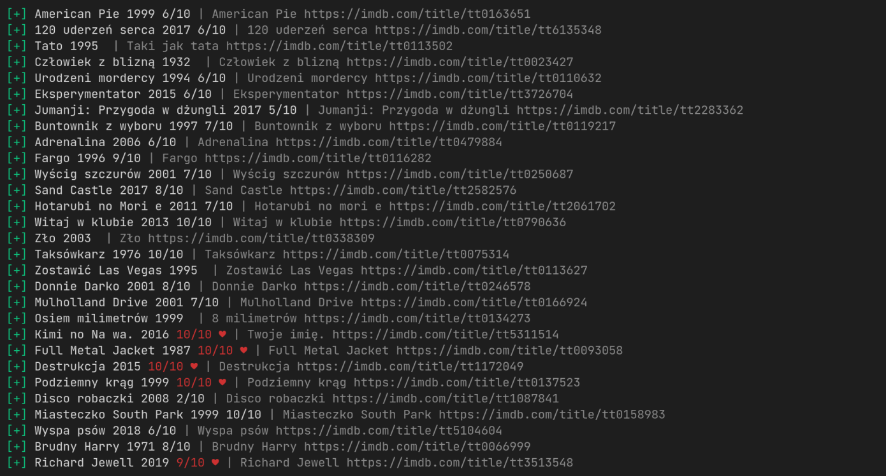

<div align="center">
  <h1>🎥 filmweb-export</h1>
  <p>export Filmweb's ratings to a TMDB / Letterboxd / ... import-compatible CSV file</p>
</div>



# Table of contents
- [Features](#features)
- [Installation](#installation)
- [Obtaining cookies](#obtaining-cookies)
- [Usage](#usage)
  - [Example usages](#examples)
- [Troubleshooting](#troubleshooting)

# Features:

- TMDB.org, Letterboxd.com compatible format (IMDb v3)
- Exports favorited, films, serials and marked to see
- Multi-threaded
- Accuracy

# Installation

  ```
  $ git clone https://github.com/micielski/filmweb-export-rs.git  
  $ cd filmweb-export-rs
  $ cargo run --release
  ```
# Obtaining cookies
  
  1. Go to a page that requires authentication (i.e. not Filmweb main page, but your profile https://filmweb.pl/user/YOUR_USERNAME)
  2. Open developer tools with F12
  3. On Firefox, navigate to the Storage tab, on Chromium; the Application tab
  4. For both browsers go to Cookies and select "https://filmweb.pl"
  5. You're searching for cookies named \_fwuser_token, \_fwuser_session, JWT. Their values are needed

# Usage
 

  ```
$ cargo run --release -- --help
filmweb-export starting...
Exports user data from filmweb.pl to IMDBv3 CSV file format

Usage: filmweb-export-rs [OPTIONS]

Options:
  -u, --username <USERNAME>
  -t, --token <TOKEN>        _fwuser_token cookie value
  -s, --session <SESSION>    _fwuser_sessionId cookie value
  -j, --jwt <JWT>            JWT cookie value
  --threads <THREADS>    Number of threads to spawn [default: 6]
  -q, --quiet                If enabled, successfully exported titles won't be printed
  -h, --help                 Print help information
  -V, --version              Print version information
  ```

## Examples

  #### Login with cookies  
  You'll be prompted for cookies if you won't specify these with flags (--token, --session, --jwt).

  ```
  $ cargo run --release
  ```
    
  #### --threads <THREADS> 
  It may be useful if your internet connection or computer at this time is poor in resources. In that case, try lowering the thread count.  
  Please note that the default value is high enough. Going above that, will hurt your exporting performance, and even cause some movies to not export!
  
  ```
  $ cargo run --release --  --threads 2
  ```
    
  #### Debug  
  If you are experiencing something abnormal, such as panics or something and you're experienced enough with rust - you may wish to enable debug printing mode
  
  ```
  $ RUST_LOG=debug cargo run --release
  ```

# Troubleshooting
  
Try lowering the threads count, otherwise, if it won't help, open an issue
